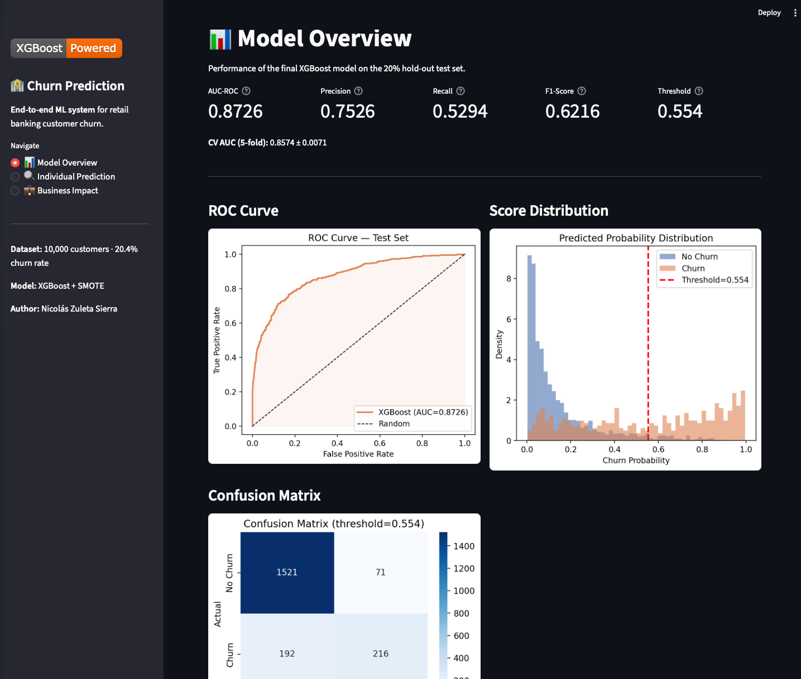

# 🏦 Banking Churn Prediction

<div align="center">


[](https://nicolaszuleta95-banking-churn-prediction.streamlit.app)


**End-to-end machine learning system to predict customer churn in retail banking —
with business impact analysis, model interpretability, and an interactive demo.**

[🚀 Live Demo](https://nicolaszuleta95-banking-churn-prediction.streamlit.app) · [📓 EDA Notebook](notebooks/01_eda.ipynb) · [📊 Model Card](reports/model_card.md)

</div>

---

## 🎯 Business Problem

Banks lose between **15–25% of their customers annually** to churn.
Each lost customer represents **$500–$2,000 USD** in foregone lifetime revenue.

Retention teams need to act *before* a customer leaves — not after.
The challenge: identifying who is at risk early enough to intervene effectively.

**This project answers three business-critical questions:**

1. **Who** is likely to churn in the next 45 days?
2. **Why** are they at risk? (what factors drive their decision)
3. **What is the business impact** of acting on these predictions vs. doing nothing?

---

## 📊 Results

The final XGBoost model — trained without the `Complain` feature (see note below) — achieves on the 20% hold-out test set:

| Metric | Score | Business Interpretation |
|--------|-------|--------------------------|
| **AUC-ROC** | **0.8726** | Strong discriminative power between churners and non-churners |
| **CV AUC (5-fold)** | **0.8574 ± 0.0071** | Stable generalization across folds |
| **Precision** | **0.7526** | 75% of flagged customers are genuinely at risk |
| **Recall** | **0.5294** | Identifies 53% of customers who will churn before they leave |
| **F1-Score** | **0.6216** | Balanced performance |
| **Accuracy** | **0.8685** | Overall classification accuracy |

> **Threshold:** Set at **0.554** to maximise Recall while keeping Precision ≥ 75% — balancing retention team effort with churn capture rate.

> **Note on `Complain`:** The dataset contains a `Complain` feature with a 99.5% correlation with churn. Including it yields AUC ~0.999, but this likely reflects data leakage (complaints recorded concurrently with churn rather than as a leading signal). The production model excludes `Complain` to ensure honest, deployable performance estimates. See [`reports/model_card.md`](reports/model_card.md) for full discussion.

---

## 🖥 Demo

The interactive Streamlit app has three sections:

- **Model Overview** — Performance metrics, ROC curve, score distributions
- **Individual Prediction** — Input a customer profile and get a churn probability + SHAP explanation of *why*
- **Business Impact Dashboard** — Revenue at risk, customers flagged, and ROI of retention intervention

👉 [**Try the live demo →**](https://nicolaszuleta95-banking-churn-prediction.streamlit.app)

> 

---

## 🏗 Project Structure

```
banking-churn-prediction/
│
├── data/
│   ├── raw/                    # Original dataset — never modified
│   └── processed/              # Cleaned data and engineered features
│
├── notebooks/
│   ├── 01_eda.ipynb            # Exploratory data analysis — business insights
│   ├── 02_feature_engineering.ipynb  # Feature creation and preprocessing
│   └── 03_modeling.ipynb       # Model comparison, tuning, SHAP, threshold optimization
│
├── src/
│   ├── __init__.py
│   ├── data_processing.py      # Data loading, validation, cleaning
│   ├── features.py             # Feature engineering (sklearn-compatible transformer)
│   ├── train.py                # Training pipeline — produces churn_model.joblib
│   └── predict.py              # Inference functions used by the Streamlit app
│
├── models/
│   └── churn_model.joblib      # Serialized trained pipeline
│
├── app/
│   └── app.py                  # Streamlit dashboard
│
├── reports/
│   └── model_card.md           # Model documentation — intended use, limitations, metrics
│
├── .gitignore
├── requirements.txt
└── README.md
```

---

## 📦 Dataset

**Source:** [Bank Customer Churn Prediction — Kaggle](https://www.kaggle.com/datasets/shubhammeshram579/bank-customer-churn-prediction)

| Property | Value |
|----------|-------|
| Records | 10,000 customers |
| Features | 14 (demographic, behavioral, product) |
| Churn rate | 20.4% |
| Class imbalance | ~5:1 (non-churn : churn) |

**Features used (13):**
- `CreditScore`, `Age`, `Tenure`, `Balance`
- `NumOfProducts`, `HasCrCard`, `IsActiveMember`
- `EstimatedSalary`, `Geography`, `Gender`
- `Satisfaction Score`, `Card Type`, `Point Earned`

> The dataset has 18 columns total. `RowNumber`, `CustomerId`, `Surname` are dropped (identifiers). `Complain` is excluded from the production model due to data leakage risk (see Results note above).

**Engineered features (created in this project):**
- `age_segment` — behavioral age grouping (Young / Mid / Senior / Elder)
- `balance_per_product` — financial engagement ratio
- `zero_balance` — flag for zero-balance accounts (churn rate 13.8%, lower than non-zero)
- `products_3plus` — flag for 3–4 products (churn rate 82–100%)
- `is_german` — flag for German customers (churn 32% vs 16% elsewhere)
- `engagement_score` — composite: activity × balance presence × log(tenure)
- `risk_profile` — combined inactivity + geography + product risk signal

---

## 🔍 Key Technical Decisions

**1. XGBoost over Random Forest as final model**
XGBoost consistently outperformed Random Forest in cross-validation AUC on this dataset. LightGBM performed similarly; XGBoost was chosen for its superior SHAP TreeExplainer integration and interpretability story.

**2. `Complain` excluded — data leakage**
The dataset's `Complain` column has a 99.5% correlation with churn, yielding AUC ~0.999 when included. This strongly suggests it's recorded at the time of churn, not before it — making it a leaky feature. The production model excludes it and achieves honest AUC 0.87.

**3. SMOTE for class imbalance**
With a ~4:1 class ratio, training without addressing imbalance biases the model toward the majority class. SMOTE applied inside the `imblearn.Pipeline` (training only) prevents leakage while improving minority-class recall.

**4. Threshold set at 0.554 instead of default 0.50**
Threshold was tuned via precision-recall curve to maximize Recall subject to Precision ≥ 75% — the right trade-off given that a retention contact costs ~$15 while missing a churner costs ~$800 in CLV.

**5. sklearn Pipeline for production readiness**
Feature engineering and inference are wrapped in a single `imblearn.Pipeline`. One `.joblib` artifact contains the full preprocessing + model — no separate preprocessing step needed at inference time.

---

## 🚀 How to Run

**1. Clone the repository**
```bash
git clone https://github.com/nicolaszuleta95/banking-churn-prediction
cd banking-churn-prediction
```

**2. Install dependencies**
```bash
pip install -r requirements.txt
```

**3. Train the model**
```bash
python src/train.py
```

**4. Launch the Streamlit app**
```bash
streamlit run app/app.py
```

---

## 📈 Business Impact Analysis

Assuming a bank with **50,000 active customers** and **$800 average customer lifetime value**:

| Scenario | Customers at Risk | Revenue at Stake | With Model Intervention |
|----------|------------------|-----------------|------------------------|
| No model (reactive) | ~10,000 | $8,000,000 lost | — |
| With this model (53% Recall) | ~5,300 identified early | ~$4,240,000 recoverable | **~$1.2M retained** (30% retention rate assumed) |

> These figures are illustrative projections scaled from test set results (2,000 customers → 50,000).
> Actual results depend on intervention strategy, customer segment, and operational retention success rate.
> A model including `Complain` would theoretically flag ~99% of churners but requires validated temporal ordering in production data.

---

## 🧠 Model Interpretability — SHAP

SHAP (SHapley Additive exPlanations) is used at two levels:

**Global** — Which features matter most across all customers?
Top drivers of churn (from SHAP analysis on test set):
1. `Age` — Customers 51+ are at significantly higher risk (3× vs under-35)
2. `NumOfProducts` — 3–4 products → 82–100% churn; 2 products → 7.6% (lowest)
3. `IsActiveMember` — Inactive members churn 2× more than active ones
4. `Balance` — High non-zero balances correlate with churn in this dataset
5. `Geography` — German customers churn at 32% vs 16% in France/Spain
6. `products_3plus` (engineered) — binary flag capturing the 3–4 product extreme
7. `Satisfaction Score` — modest signal, not monotonically linear

> **Counterintuitive finding from EDA:** Zero-balance accounts churn *less* (13.8%) than accounts with balance (24.1%) — opposite of the common assumption. This was confirmed in the data and reflected in feature engineering.

**Local** — Why is *this specific customer* at risk?
The Streamlit app shows a SHAP waterfall chart for any individual prediction, explaining the top factors pushing that customer toward or away from churn.

---

## 🛠 Tech Stack

| Category | Tools |
|----------|-------|
| Data manipulation | `pandas`, `numpy` |
| Machine Learning | `scikit-learn`, `xgboost`, `lightgbm` |
| Imbalanced data | `imbalanced-learn` (SMOTE) |
| Interpretability | `shap` |
| Visualization | `matplotlib`, `seaborn`, `plotly` |
| App & deployment | `streamlit` |
| Serialization | `joblib` |

---

## 📄 Model Card

See [`reports/model_card.md`](reports/model_card.md) for full documentation including:
- Intended use and out-of-scope uses
- Training data description
- Performance across demographic subgroups
- Known limitations and failure modes
- Recommendations for deployment

---

## 👤 Author

**Nicolás Zuleta Sierra**
Data Scientist · 7+ years in data analytics · Medellín, Colombia

[](https://www.linkedin.com/in/nicolaszuletasierra/)
[](https://github.com/nicolaszuleta95)
[](mailto:nicolaszuleta95@gmail.com)

---

## 📝 License

This project is licensed under the MIT License — see [LICENSE](LICENSE) for details.

---